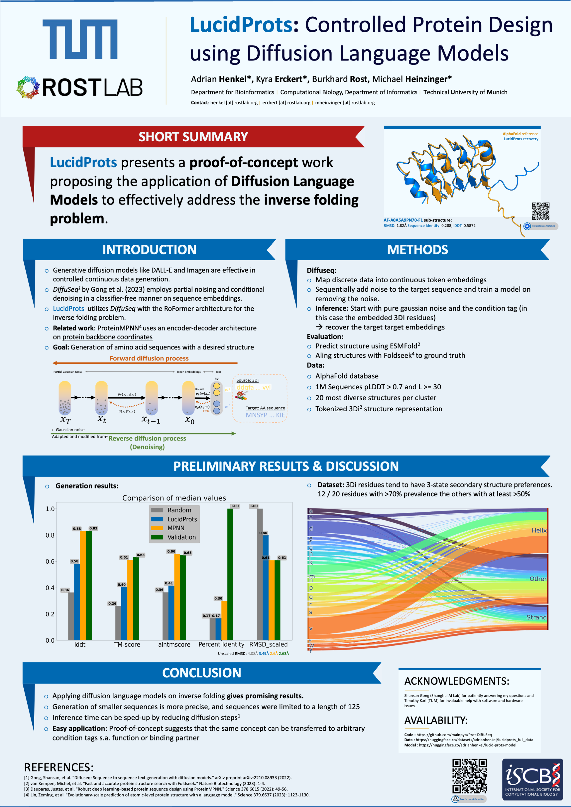

# LucidProts

This is the repository for **LucidProts** presented at the ISCB/ECCB 2023. We investigated the suitablity of Diffusion Language Models for controlled protein sequence design conditioned. We leveraged the inverse folding problem for this proof-of-concept work. 
______
### Authors: 
Adrian Henkel, Kyra Erckert, Burkhard Rost and Michael Heinzinger
______

### Resources:
* [Model](https://huggingface.co/adrianhenkel/lucid-prots-model)
* [Tokenized Dataset](https://huggingface.co/datasets/adrianhenkel/lucidprots_full_data)
* [Tokenizer](https://huggingface.co/adrianhenkel/lucid-prot-tokenizer)

### Poster

